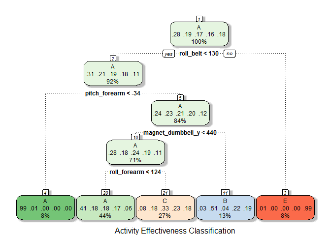
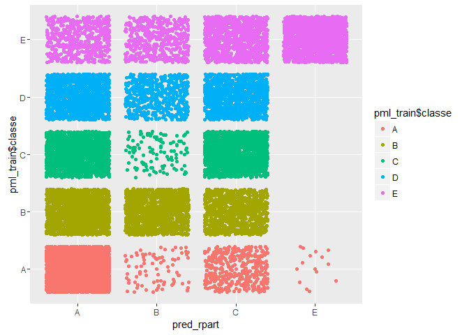
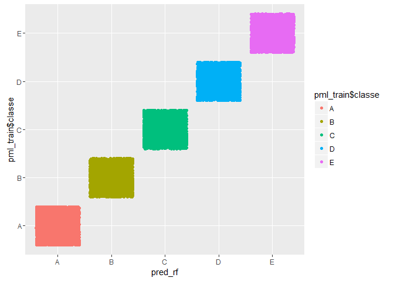

# Activity Prediction Modelr
Aish Varadhan  
April 21, 2016  

#### 1. Load Libaries & Data
##### Load required libraries for loading data and machine learning algorithm application

```r
library(dplyr, quietly = TRUE, warn.conflicts = FALSE)
library(ggplot2, quietly = TRUE, warn.conflicts = FALSE)
library(reshape2, quietly = TRUE, warn.conflicts = FALSE)
library(caret, quietly = TRUE, warn.conflicts = FALSE)
library(rattle, quietly = TRUE, warn.conflicts = FALSE)
```

```
## Rattle: A free graphical interface for data mining with R.
## Version 4.1.0 Copyright (c) 2006-2015 Togaware Pty Ltd.
## Type 'rattle()' to shake, rattle, and roll your data.
```

```r
library(randomForest, quietly = TRUE, warn.conflicts = FALSE)
```

```
## randomForest 4.6-12
## Type rfNews() to see new features/changes/bug fixes.
```

```r
setwd("c:/Users/avarad/Documents/R/8-PML/")
pml_train <- read.csv("pml-training.csv",header=TRUE)
pml_test <- read.csv("pml-testing.csv",header=TRUE)
pml_train <- tbl_df(pml_train)
pml_test <- tbl_df(pml_test)
```

#### 2. Extract Relevant Predictors
##### We look at the variables in the training data set and remove the first 7 that have nothing to do with the outcome, classe as these are usernames, row numbers, time stamps, etc. We also remove the classe variable from the list of predictors as this is the outcome we need to predict. We then only look at the variables that contain roll, pitch, yaw, gyroscopic, acceleration, magnetometer and total acceleration information and ignore all other summary variables such as min, max, avg, stddev, var, kurtosis and skewness as these are already captured in their entirety in their main variable measures. We then formulate a string that expresses the variable classe as a outcome of all these extracted predictors

```r
all_predictors <- names(pml_train)[8:159]
filtered_predictors <- grep("^(roll|pitch|yaw|gyros|accel|magnet|total)_",all_predictors,value = TRUE)
ml_formula <- paste("classe ~ ", paste(filtered_predictors,collapse = " + "))
```

#### 3. Model Fitting & Cross Validation
##### We then fit two models with cross-validation for the classe outcome as a function of all the above predictors. We use the CART (classification Trees) and Random Forest approach to fit two different models. We perform  cross validation using the trainControl() function and use the repeatedCv with 10 repetitions.

```r
set.seed(786543)
trc <- trainControl(method="repeatedcv",repeats = 10)
ml_model_rpart <- train(eval(parse(text=ml_formula)),data = pml_train,method="rpart",trControl = trc)
```

```
## Loading required package: rpart
```

```r
ml_model_rf <- randomForest::randomForest(eval(parse(text=ml_formula)),data = pml_train)
```

#### 4. Model Exploration, Accuracy and COnfusion Matrices
##### We then explore some of the model attributes for both the models viz. prediction accuracy (by using the model on the training set), the confusion matrix and a out of sampel errors.

```r
ml_model_rpart$finalModel
```

```
## n= 19622 
## 
## node), split, n, loss, yval, (yprob)
##       * denotes terminal node
## 
##  1) root 19622 14042 A (0.28 0.19 0.17 0.16 0.18)  
##    2) roll_belt< 130.5 17977 12411 A (0.31 0.21 0.19 0.18 0.11)  
##      4) pitch_forearm< -33.95 1578    10 A (0.99 0.0063 0 0 0) *
##      5) pitch_forearm>=-33.95 16399 12401 A (0.24 0.23 0.21 0.2 0.12)  
##       10) magnet_dumbbell_y< 439.5 13870  9953 A (0.28 0.18 0.24 0.19 0.11)  
##         20) roll_forearm< 123.5 8643  5131 A (0.41 0.18 0.18 0.17 0.061) *
##         21) roll_forearm>=123.5 5227  3500 C (0.077 0.18 0.33 0.23 0.18) *
##       11) magnet_dumbbell_y>=439.5 2529  1243 B (0.032 0.51 0.043 0.22 0.19) *
##    3) roll_belt>=130.5 1645    14 E (0.0085 0 0 0 0.99) *
```

```r
fancyRpartPlot(ml_model_rpart$finalModel,sub = "Activity Effectiveness Classification")
```

 

```r
pred_rpart <- predict(ml_model_rpart, newdata = pml_train)
table(pred_rpart,pml_train$classe)
```

```
##           
## pred_rpart    A    B    C    D    E
##          A 5080 1581 1587 1449  524
##          B   81 1286  108  568  486
##          C  405  930 1727 1199  966
##          D    0    0    0    0    0
##          E   14    0    0    0 1631
```

```r
qplot(pred_rpart,pml_train$classe,col=pml_train$classe) + geom_jitter()
```

 


```r
ml_model_rf$confusion
```

```
##      A    B    C    D    E  class.error
## A 5578    1    0    0    1 0.0003584229
## B   11 3783    3    0    0 0.0036871214
## C    0   11 3409    2    0 0.0037989480
## D    0    0   19 3195    2 0.0065298507
## E    0    0    0    3 3604 0.0008317161
```

```r
pred_rf <- predict(ml_model_rf, newdata = pml_train)
table(pred_rf,pml_train$classe)
```

```
##        
## pred_rf    A    B    C    D    E
##       A 5580    0    0    0    0
##       B    0 3797    0    0    0
##       C    0    0 3422    0    0
##       D    0    0    0 3216    0
##       E    0    0    0    0 3607
```

```r
qplot(pred_rf,pml_train$classe,col=pml_train$classe) + geom_jitter()
```

 


#### 5. Test Set prediction
##### Since the random forest model does better in terms of not over/under fitting, we use this model on the test set to predict the classe variable

```r
predict(ml_model_rf,newdata = pml_test)
```

```
##  1  2  3  4  5  6  7  8  9 10 11 12 13 14 15 16 17 18 19 20 
##  B  A  B  A  A  E  D  B  A  A  B  C  B  A  E  E  A  B  B  B 
## Levels: A B C D E
```

#### 6. Summary
##### We seleced the CART and RandomForests algorithms as both of these are better performing for categorical variables and non-linear functions. As we can see, the error from the RPART model is much higher than that of RF and hence we chose to use RF for the  test test prediction. 
